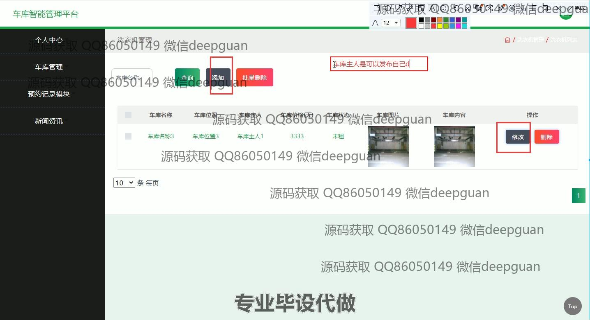

<h1 align="center">基于Tomcat技术的车库智能管理平台</h1>

## 简介
车库智能管理平台：角色分为管理员、用户；功能包括用户管理、车库管理、预约记录、个人信息编辑、系统管理及平台新闻。    --计算机毕业设计源码；毕设源码；java毕业设计源码

## 联系方式

<h3 align="center">获取完整代码与数据库文件 + 微信：deepguan QQ: 86050149 QQ群: 783742310</h3>

<h3 align="center">可帮忙远程部署 包运行成功！提供远程部署、修改代码、设计文档指导、代码讲解等服务！</h3>

## 功能介绍（完整见运行截图）
管理员：基本功能包括登录、注册及退出。可以通过网站首页的导航栏访问各模块。具备管理用户、车库以及预约记录的能力。可编辑和删除用户信息或车库信息，并处理租用请求。支持查看系统日志和调试，确保平台功能正常运行。

车库主人：登录后可以管理自身的车库信息，包括查看车库状态、更新车库详情如价格和图片。能查看预约请求，批准租用或进行车库出租相关操作。可以在个人中心管理自己的个人信息和查看相关租赁记录。

一般用户：具备登录、注册和退出功能。在平台首页可以浏览车库信息，查看详细介绍和图片。可通过预约模块选择合适的车库进行预约。支持取消或续约租用车库并在个人中心更新个人信息和查看租赁历史。

## 运行截图

本代码来源于网络,仅供学习参考使用!

